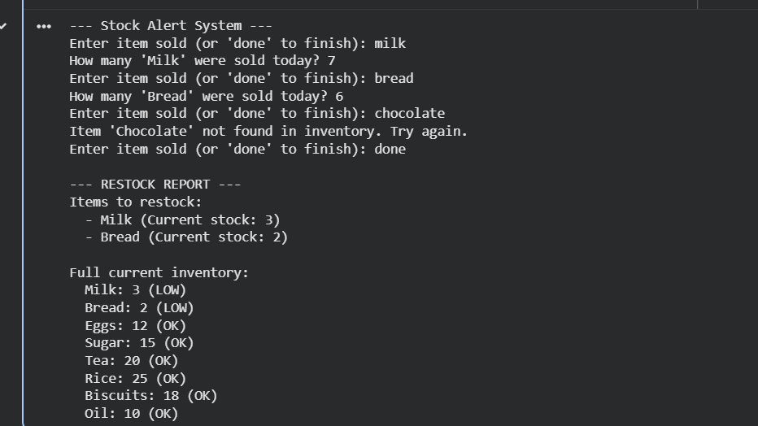

# CSE1021-Python-Project
# Community Shop Inventory & Alert System

### 1. Project Overview & Significance
The **Community Shop Inventory & Alert System** is a purposeful Python application designed to solve a common problem faced by small-scale grocery vendors. In many communities, shopkeepers rely on manual, paper-based tracking, which frequently leads to "stock-outs" of essential daily goods like milk or bread. 

This project provides a digital solution that allows shopkeepers to track daily sales interactively and automatically generates a "Restock Report" whenever an item's quantity falls below a critical threshold. By digitizing this process, the system helps prevent revenue loss and ensures the community has consistent access to necessary supplies.

### 2. Academic Context (CSE1021)
This project serves as a comprehensive application of the **CSE1021: Introduction to Problem Solving and Programming** syllabus. It utilizes fundamental algorithm design techniques to solve a real-world computing problem.
* **Control Flow:** Implements `while` loops and conditional branching (`if-elif-else`) for dynamic user interaction.
* **Data Structures:** Uses **Python Dictionaries** for efficient inventory lookups and **Sets** for mandatory duplicate removal.
* **Error Handling:** Employs `try-except` blocks to manage non-numeric inputs, ensuring program robustness.
* **Logic:** Follows a "Top-Down Design" methodology, breaking the problem into Input, Processing, and Output modules.

### 3. Technical Setup & Installation
To run this project, you must have **Python 3.x** installed on your computer. The system relies entirely on standard Python modules, so no external libraries are required.

1.  **Download:** Save the `inventory_system.py` file to your local machine.
2.  **Navigate:** Open your terminal or command prompt and navigate to the folder containing the file.
3.  **Execute:** Run the program by typing the following command:
    ```bash
    python inventory_system.py
    ```
4.  **Interface:** The program operates in an interactive command-line mode, providing immediate feedback for every entry.

### 4. How to Use the System
1.  **Enter Item:** When prompted, type the name of the item sold (e.g., `Milk`). The system is case-insensitive and handles extra spaces.
2.  **Enter Quantity:** Input the number of units sold. If you enter an invalid character (like a letter), the error handling logic will prompt you to try again.
3.  **Finalize:** Once the shift is over, type **`done`** to trigger the final analysis.
4.  **Review:** The system will display a **Restock Report** for all items below the minimum threshold (5 units) and a full status update of your inventory.

### 5. Program Execution & Output
The following screenshot demonstrates a successful execution of the system, including error handling for invalid inputs and the generation of the final Restock Report.



### 6. Key Features
* **Case Standardization:** Automatically handles inputs like "milk" or "mILK" to match the database using `.capitalize()`.
* **Input Validation:** Prevents crashes from non-numeric data or negative quantities using `try-except`.
* **Real-time Logic:** Subtracts sales from current stock and flags "LOW" status immediately.
* **Duplicate Removal:** Uses set operations to ensure the Restock Report is concise and accurate.
